# Minesweeper

**Developer: Harrison Townend**

## Table of Contents
  - [Project Goals](#project-goals)
    - [User Goals](#user-goals)
    - [Site Owner Goals](#site-owner-goals)
  - [User Experience](#user-experience)
    - [Target Audience](#target-audience)
    - [User Requirements and Expectations](#user-requirements-and-expectations)
    - [User Manual](#user-manual)
  - [User Stories](#user-stories)
    - [Users](#users)
    - [Site Owner](#site-owner)
  - [Technical Design](#technical-design)
    - [Flowchart](#flowchart)
  - [Technologies Used](#technologies-used)
    - [Languages](#languages)
    - [Frameworks & Tools](#frameworks--tools)
    - [Libraries](#libraries)
  - [Features](#features)
  - [Validation](#validation)
  - [Testing](#testing)
    - [Manual Testing](#manual-testing)
    - [Automated Testing](#automated-testing)
  - [Bugs](#bugs)
  - [Deployment](#deployment)
  - [Credits](#credits)
  - [Acknowledgements](#acknowledgements)

## Project Goals
### User Goals
- To play a fun and engaging game
- Play quickly without a long setup
- Track progress using scores and times
### Site Owner Goals
- To create a fun and engaging game
- Allow users to play quickly without difficulty
- Include user engagement in the form of a name input.

## User Experience

### Target Audience
Minesweeper can target all age ranges from children testing their puzzle solving to older adults casually playing games.
### User Requirements and Expectations
- The user should expect no error to occur during playing
- The user should be shown the correct format for inputs, with error displaying what was wrong
- The user should expect engagement from the game, in the form of a name input
- The user should expect a list of rules to improve their time playing

### User Manual

#### Home Screen
At first the user is presented with large blue text 'MINESWEEPER' and an input for the username below it.
Upon entering a valid username they are taken to the main menu of the game.
<details>
    <summary>Home screen image</summary>
    
</details>

#### Main Menu
When reaching the main menu the username inputted name is displayed at the top of the console with a welcome message.
They are also given a list of 4 options to pick from with an input at the bottom for their choice.
<details>
    <summary>Main menu image</summary>
    
</details>

#### Play
When the user decides to play the game they are given an option to select their grid size and mine count.<br>
This ranges from a 10x10 to a 18x18 for the grid size, and 10-30 mines. <br>
After selection their game options they are displayed the minesweeper grid.

<details>
    <summary>Game options</summary>
    <br>
    <br>
    
</details>

#### Game rules
If the user selected the second option they are taken to the rules tab. <br>
This includes a list of instructions for playing Minesweeper to help the user. <br>
After the list the user hits an input which will return them to the main menu
<details>
    <summary>Game rules</summary>
    
</details>

#### Game tips
If the user selected the thrid option they are taken to the tips tab. <br>
This is a list of tips to help the user succeed when playing the game. <br>
After the list the user hits an input which will return them to the main menu
<details>
    <summary>Game tips</summary>
    
</details>

#### Game stats
If the user selected the fourth option they are taken to the stats tab. <br>
This is a list of stats the user can access that is automatically updated from a google spreadsheet as they play. <br>
After the list the user hits an input which will return them to the main menu.

<details>
    <summary>Game stats</summary>
    
</details>

## User Stories

### Users

1. As a player of the game, I would like to select the difficulty of the game before playing in the form of grid size and amount of mines.
2. As a player of the game, I would like to be able to restart the game quickly after finishing the previous one.
3. As a player of the game, I would like to be able to read the rules to understand the game.
4. As a player of the game, I would like to have fun playing the game.
5. As a player of the game, I would like the game to be simple and easy to understand.
6. As a player of the game, I would like to be able to enter my name so it feel more engaging.
7. As a player of the game, I would like to be able to see my score at the end of the game.
8. As a player of the game, I would like to be able to see my time taken at the end of the game.
9. As a player of the game, I would like to be able to flag tiles that i think are dangerous.

### Site Owner
10. As the site owner, I would like to provide a fun and addicting game to users.
11. As the site owner, I would like to provide the users with a difficilty selector in the form of grid size and amount of mines.
12. As the site owner, I would like stats of the game to be updated into a Google spreadsheet which users can see.
14. As the site owner, I would like to create validation with error messages to guide users for any user inputs.
15. As the site owner, I would like to provide a clear and simple game interface for the user to use.

## Technical Design
For python the best method to plan a project is to use a flowchart, this breaks down each function and makes it very clear when you start creating your project

### Flowchart
My flowchart was made using the VS Code extention called 'Draw.io', making a flowchart made it really easy to create the functions.
<details>
    <summary>Flowchart</summary>
    
</details>

## Technologies Used

### Languages
This project was built using [Python3](https://www.python.org/)

### Frameworks & Tools
- [draw.io](https://www.drawio.com/) - This was used to create my flowchart from the VS Code extention
- [Github](https://github.com/)
- Github Pages
- [Google Sheets](https://workspace.google.com/products/sheets/) - This was used to store the data 
- [Google Cloud Platform](https://cloud.google.com/cloud-console/) - This was used to allow google sheets to communicate with my code
- [CI linter](https://pep8ci.herokuapp.com/) - This was used to test my code for errors

### Libraries
- gspread - This was used to link my project to a google sheet
- google.oauth2.service_account - This was used to import personal credentials into my project to allow it to communite with the google spreadsheet, these are stored in a JSON file hidden by the gitignore folder
<br>

- random - This was imported to allow me to randomise where the mines are placed in each new game.
- os - This was imported to add a function to clear the console.
- [colorama](https://pypi.org/project/colorama/) - This was used to colour text and add the title screen.
- time - This was used to add a timer to the game.

## Features

### Home screen + Enter name
My homescreen has a simple design with a large title 'MINESWEEPER', which is occupanied by an input function to ask the user for their name.
<details>
    <summary>Homescreen image</summary>
    
</details>

### Main menu + Users greeting
when the user enters a name which passes the validation they are taken to the main menu, this shows a welcome message with the users name in it. <br>
This also includes 4 options of:
- play game
- Rules
- Tips
- Stats
They are then given a prompt to select one of the 4 options using the numbers 1-4.
<details>
    <summary>Main menu image</summary>
    
</details>


### Game rules
The game rules tab explains to the user how to play minesweeper, if they are a first time player.
There is also a prompt to allow the user to return back to the main menu once they have finished reading the rules.
<details>
    <summary>rules tab</summary>
    
</details>

### Game tips
The tips tab gives useful tips to the user to help them succeed when they play the game.
There is also a prompt to allow the user to return back to the main menu once they have finished reading the tips.
<details>
    <summary>Tips tab</summary>
    
</details>

### Game stats
The stats pages shows general stats such as 'Games play' and 'Mines hit'. <br>
It is linked to a google sheets which updates as the user plays. and the users can access this from the main menu option.
There is also a prompt to allow the user to return back to the main menu once they have finished reading the stats. 
<details>
    <summary></summary>
    
</details>

### Game start
When the game starts the user is displayed with two inputs that asks for a grid size and a mine amount. <br>
When the inputs are successfully inputted they are shown a grid with labeled x and y axis' with an input that allows them to select a coordinate.
A user can mark a tile using a '#' before the coordinate '#b3'
<details>
    <summary>Game grid</summary>
    
</details>
<details>
    <summary>Tile flag/summary>
    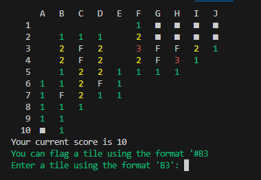
</details>

### Middle of game
When a user selects a tile it is revealed, if it is a safe tile, all other safe tiles connected to the selected tile are also revealed.
<details>
    <summary>Revealed tiles</summary>
    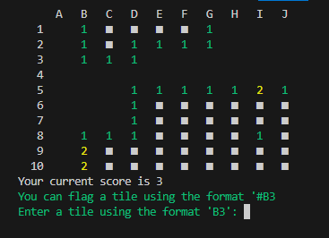
</details>

### Finished Game
When a user either reveals all safe tiles or hits a mine when revealing a tile, they are shown the enitre revealed grid.
There is also a prompt to allow the user to return back to the main menu once they have finished the game.
<details>
    <summary>Game win</summary>
    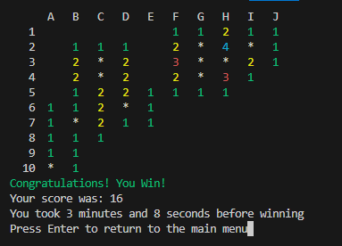
</details>

<details>
    <summary>Game lose</summary>
    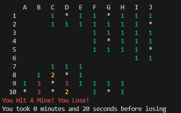
</details>

### User Input Validation
There are multiple validations thoughout the game including:
- Name
- Main Menu Selection
- Coordinate input
- re-revealing the same tile
- revealing a flagged tile

<details>
    <summary>Username validation</summary>
    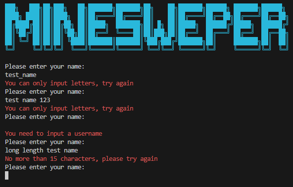
</details>
<details>
    <summary>Game selection validation</summary>
    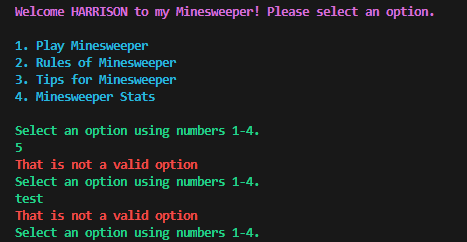
</details>
<details>
    <summary>Grid input validation</summary>
    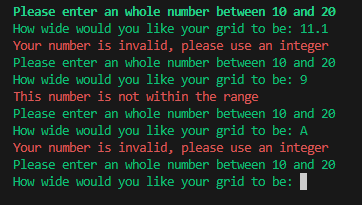
    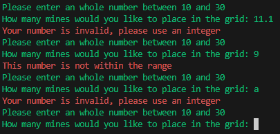
</details>
<details>
    <summary>Coordinate validation</summary>
    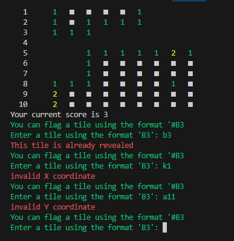
</details>


## Validation

## Testing
### Manual Testing

## Bugs

## Deployment
### Render
I deployed my project to [render](https://dashboard.render.com/) as recommened by my mentor, these are the steps I took inorder deploy it.

1. Create a render account and connect your Github page to it.
2. Select '+ new' and then select 'Web Service'.
3. Select the Github repository you want to deploy, This will automatically fill some of the settings such as, branch and language.
<details>
    <summary>Select repository</summary>
    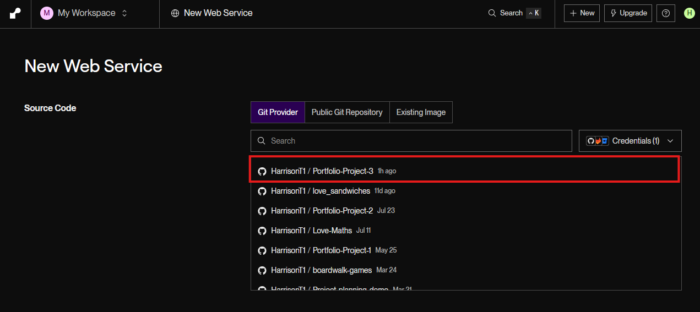
</details>

4. Customise the settings, changing the build and start commands to as shown below and in the image, and select the free option for instance type.

Build command

```
pip install -r requirements.txt && npm install
```
Start command

```
node index.js
```
<details>
    <summary></summary>
    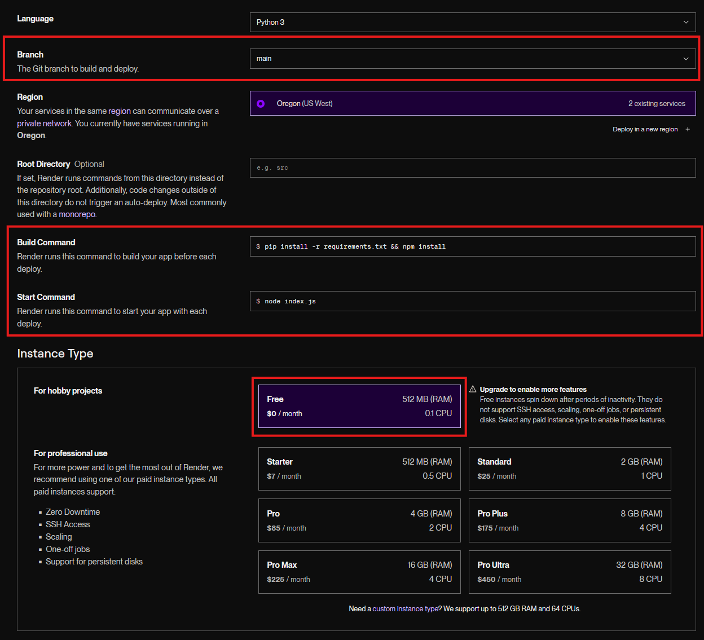
</details>

5. Make sure to add the creds.JSON file as a secret sensitive information isnt exposed.
- Make the file name creds.JSON
- copy and paste the contents of the creds.JSON file into the contents section
<details>
    <summary></summary>
    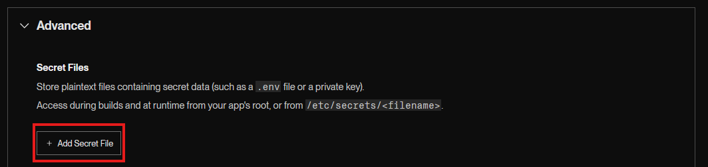
</details>
<details>
    <summary></summary>
    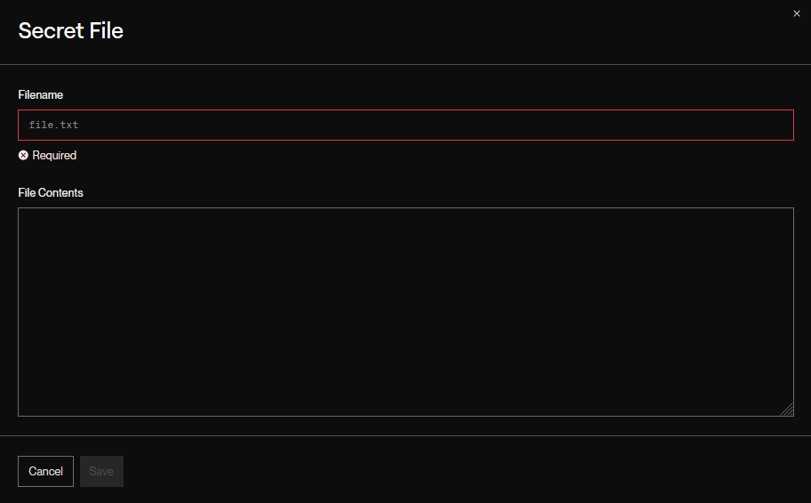
</details>

6. Scroll to the bottom and click Deploy Web service.


## Credits
### Code
## Acknowledgements
Huge thanks to Code Institute for this opportunity, this project was made for my portfolio project 3 within Code Institute's course.
Massive thanks to my mentor [Mo Shami](https://www.linkedin.com/in/moshami/) and my friend [Mike Ralph](https://www.linkedin.com/in/mike-ralph-891757112/) as well as the slack community and the Code Institute learning tutors for the help along the way.