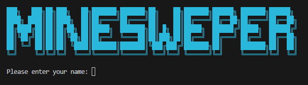
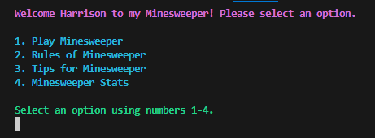
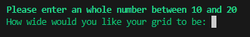
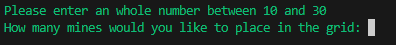
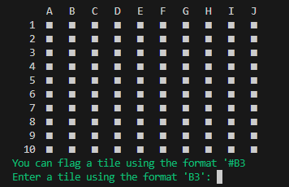
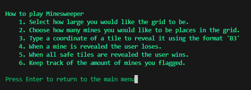
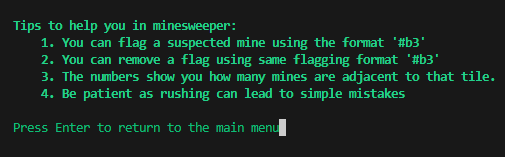
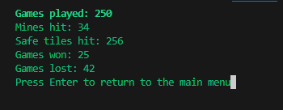
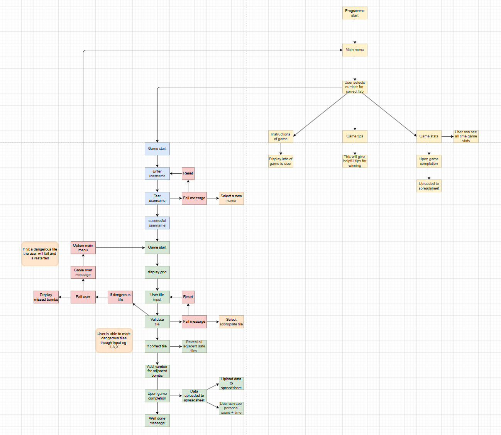

# Minesweeper

**Developer: Harrison Townend**

## Table of Contents
  - [Project Goals](#project-goals)
    - [User Goals](#user-goals)
    - [Site Owner Goals](#site-owner-goals)
  - [User Experience](#user-experience)
    - [Target Audience](#target-audience)
    - [User Requirements and Expectations](#user-requirements-and-expectations)
    - [User Manual](#user-manual)
  - [User Stories](#user-stories)
    - [Users](#users)
    - [Site Owner](#site-owner)
  - [Technical Design](#technical-design)
    - [Flowchart](#flowchart)
  - [Technologies Used](#technologies-used)
    - [Languages](#languages)
    - [Frameworks & Tools](#frameworks--tools)
    - [Libraries](#libraries)
  - [Features](#features)
  - [Validation](#validation)
  - [Testing](#testing)
    - [Manual Testing](#manual-testing)
    - [Automated Testing](#automated-testing)
  - [Bugs](#bugs)
  - [Deployment](#deployment)
  - [Credits](#credits)
  - [Acknowledgements](#acknowledgements)

## Project Goals
### User Goals
- To play a fun and engaging game
- Play quickly without a long setup
- Track progress using scores and times
### Site Owner Goals
- To create a fun and engaging game
- Allow users to play quickly without difficulty
- Include user engagement in the form of a name input.

## User Experience

### Target Audience
Minesweeper can target all age ranges from children testing their puzzle solving to older adults casually playing games.
### User Requirements and Expectations
- The user should expect no error to occur during playing
- The user should be shown the correct format for inputs, with error displaying what was wrong
- The user should expect engagement from the game, in the form of a name input
- The user should expect a list of rules to improve their time playing

### User Manual

#### Home Screen
At first the user is presented with large blue text 'MINESWEEPER' and an input for the username below it.
Upon entering a valid username they are taken to the main menu of the game.

    
Home screen image

    

#### Main Menu
When reaching the main menu the username inputted name is displayed at the top of the console with a welcome message.
They are also given a list of 4 options to pick from with an input at the bottom for their choice.

    
Main menu image

    

#### Play
When the user decides to play the game they are given an option to select their grid size and mine count. 
This ranges from a 10x10 to a 20x20 for the grid size, and 10-30 mines.  
After selection their game options they are displayed the minesweeper grid.

    
Game options

     
     
    

#### Game rules
If the user selected the second option they are taken to the rules tab.  
This includes a list of instructions for playing Minesweeper to help the user.  
After the list the user hits an input which will return them to the main menu

    
Game rules

    

#### Game tips
If the user selected the thrid option they are taken to the tips tab.  
This is a list of tips to help the user succeed when playing the game.  
After the list the user hits an input which will return them to the main menu

    
Game tips

    

#### Game stats
If the user selected the fourth option they are taken to the stats tab.  
This is a list of stats the user can access that is automatically updated from a google spreadsheet as they play.  
After the list the user hits an input which will return them to the main menu.

    
Game stats

    

## User Stories

### Users

1. As a player of the game, I would like to select the difficulty of the game before playing in the form of grid size and amount of mines.
2. As a player of the game, I would like to be able to restart the game quickly after finishing the previous one.
3. As a player of the game, I would like to be able to read the rules to understand the game.
4. As a player of the game, I would like to have fun playing the game.
5. As a player of the game, I would like the game to be simple and easy to understand.
6. As a player of the game, I would like to be able to enter my name so it feel more engaging.
7. As a player of the game, I would like to be able to see my score at the end of the game.
8. As a player of the game, I would like to be able to see my time taken at the end of the game.
9. As a player of the game, I would like to be able to flag tiles that i think are dangerous.
### Site Owner

10. As the site owner, I would like to provide a fun and addicting game to users.
11. As the site owner, I would like to provide the users with a difficilty selector in the form of grid size and amount of mines.
12. As the site owner, I would like stats of the game to be updated into a Google spreadsheet which users can see.
14. As the site owner, I would like to create validation with error messages to guide users for any user inputs.
15. As the site owner, I would like to provide a clear and simple game interface for the user to use.

## Technical Design
For python the best method to plan a project is to use a flowchart, this breaks down each function and makes it very clear when you start creating your project

### Flowchart
My flowchart was made using the VS Code extention called 'Draw.io', making a flowchart made it really easy to create the functions.

    
Flowchart

    

## Technologies Used
### Languages
### Frameworks & Tools
### Libraries

## Features
### Main menu
### Enter name
### Users greeting
### Game rules
### Game tips
### Game stats
### Game start
### Finished Game
### User Input Validation

## Validation

## Testing
### Manual Testing
### Automated Testing

## Bugs

## Deployment
### Render

## Credits
### Code
## Acknowledgements